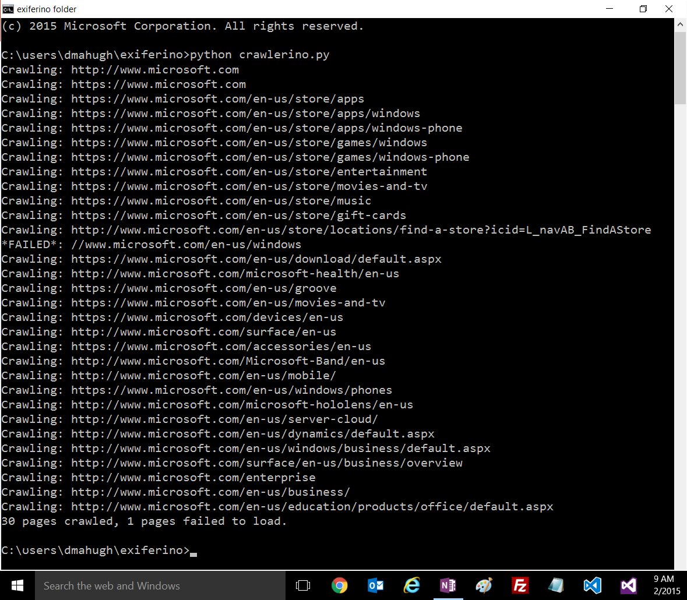
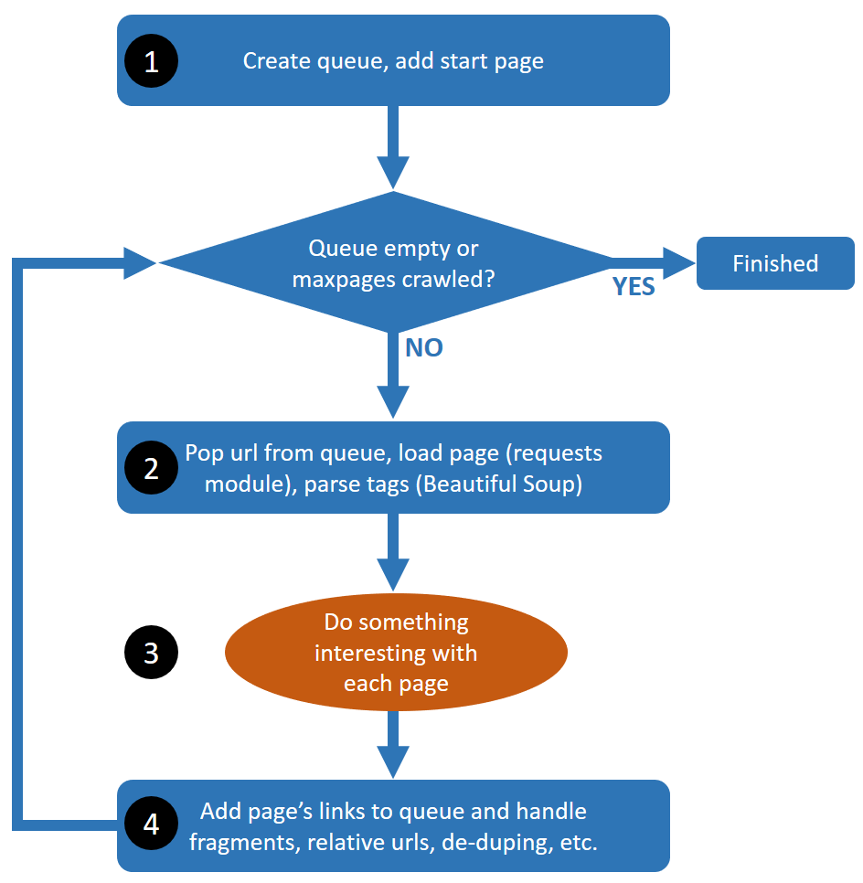

<properties LandingPageTags="Python,webscraping,webcrawling" />
# crawlerino - simple Python 3 web crawler
Crawlerino is a web crawler written in Python 3, and is intended to be used as a starting point for building customized web crawlers to perform various tasks. NOTE: the code is optimized for *readability and flexibility*, not for performance.

The emphasis here is on simplicity, and to that end here are some things that crawlerino does _not_ handle:

* It doesn't handle authentication, although the use of requests makes this easy to add if needed.
* It doesn't spoof headers. Again, easy to add via requests if desired.
* It ignores robots.txt.

It uses the ```requests``` and ```Beautiful Soup (bs4)``` modules, which help keep the code as simple as possible.

## Installation
Since crawlerino is simply intended as a starting point for customization, it isn't packaged as a Python module. But there are only two dependencies so it's easy to install manually. You need to have Python 3.x installed, and then you just need to install requests and Beautiful Soup:

```
c:\myfolder> pip install requests
c:\myfolder> pip install beautifulsoup4
```
Then you can run crawlerino with the command ```python crawlerino```, and you'll see the output from the test case:



## Customization
As it stands, crawlerino simply crawls the links on pages and it doesn't do anything with the content it finds. To add your custom processing, insert code at **step 3** in the diagram below (line 38 in the source code). There you have access to the current page as either ```response``` (from requests.get) or ```soup``` (the parsed version from Beautiful Soup).

In some cases, you may also want to customize the rules for recursively scanning links, to ignore certain types of links or destination, add authentication, enforce robots.txt, and so on. This is **step 4** in the diagram below (lines 42-50 in the source code). The basic concept there is that ```links``` is a list of the links from the current page that should be added to the crawling queue, and you can edit the content of ```links``` as desired before it gets added to the queue in line 55.



For more information about the approach taken, see the blog post [Crawling the web with Python 3.x](http://mahugh.com/2015/12/12/crawling-the-web-with-python-3-x/).
